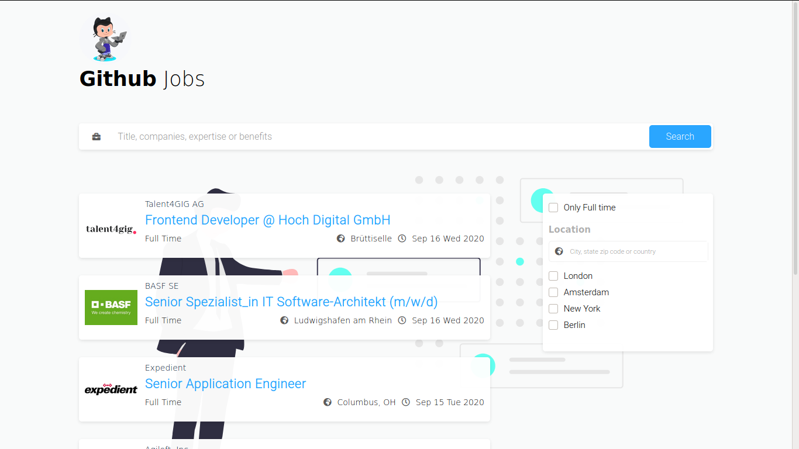
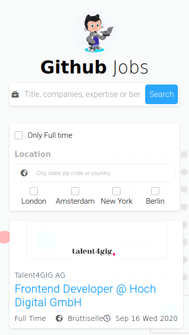

<!-- Please update value in the {}  -->

<h1 align="center"><a href="https://eufraniodiogo.github.io/Github-Jobs">Github Jobs</a></h1>

  <h3>
    <a href="https://eufraniodiogo.github.io/Github-Jobs">
      Demo
    </a>
     | 
    <a href="https://github.com/EufranioDiogo/Github-Jobs">
      Solution
    </a>
  </h3>

Do you want to find a job at Github? Access the most exciting and modern Web App to catch up all your needs<a href="https://eufraniodiogo.github.io/Github-Jobs">Access</a>

## Table of Contents

- [Table of Contents](#table-of-contents)
- [Overview](#overview)
  - [Built With](#built-with)
- [Contact](#contact)

## Overview

- Where can I see your demo? 
  [Here](https://eufraniodiogo.github.io/Github-Jobs)
- What was your experience? 
  I had a very nice experience doing this challenges it was one of the challenges that I say I can't do it, but I did! "Believe in yourself".
- What have you learned/improved? 
  Working with HTTP Header, XHTTP API and how filter information by parameters

### Built With

<!-- This section should list any major frameworks that you built your project using. Here are a few examples.-->

- VUE.
- JS
- HTML
- CSS

## Contact

- [Website](https://eufraniodiogo.github.io)
- [GitHub](https://github.com/EufranioDiogo)
- Email: eufraniodiogo5@gmail.com
